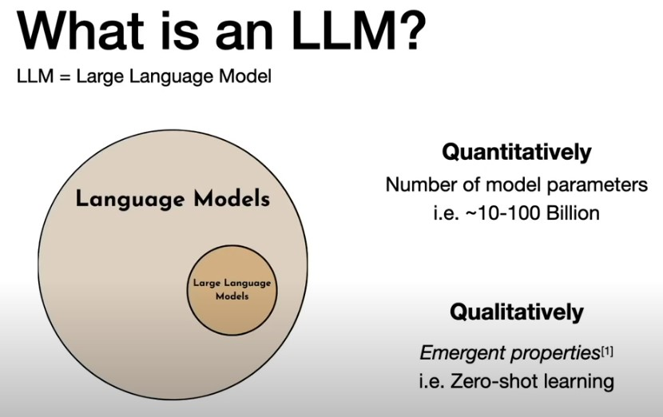

# What is an LLM?

#### LLM = Large Language Model

- LLMs like ChatGPT are powerful text-based AI systems.

- They differ from older models by:
  - Quantitative scale: billions of parameters.
    - Parameters are the internal numerical values that the model learns during training.
    - These values determine how the model processes input and generates output.
    - More parameters = greater capacity to model complex language patterns.
      - GPT-2: ~1.5 billion parameters
      - GPT-3: ~175 billion parameters
      - GPT-4 (est.): hundreds of billions (exact size not publicly confirmed)
    
  - Qualitative traits: emergent capabilities like zero-shot learning (solving tasks without specific training).
      - Zero-shot learning:
        - The ability to perform tasks without any task-specific training or examples.
        - Example: Prompting a model to translate a sentence even though it wasn’t explicitly trained to translate.
        
      - Few-shot learning:
        - Solving new tasks with just a handful of examples provided in the prompt.
        - Example: Giving 2–3 examples of classifying sentiment, the model accurately continues the task.

Built using self-supervised learning (e.g., predicting the next word), not traditional supervised labeling.

  

  
