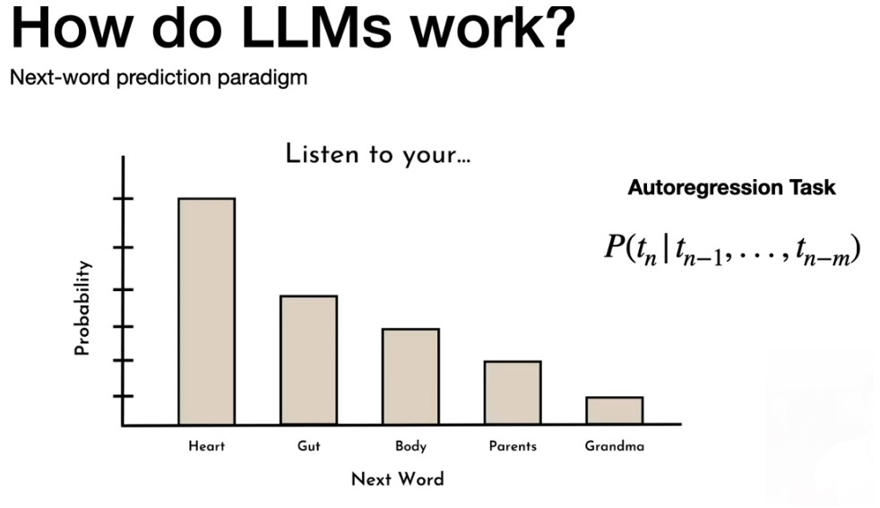

# What is an LLM?

#### LLM = Large Language Model

- LLMs like ChatGPT are powerful text-based AI systems.

  
  
- They differ from older models by:
  - ### Quantitative scale: billions of parameters.
    - Parameters are the internal numerical values that the model learns during training.
    - These values determine how the model processes input and generates output.
    - More parameters = greater capacity to model complex language patterns.
      - GPT-2: ~1.5 billion parameters
      - GPT-3: ~175 billion parameters
      - GPT-4 (est.): hundreds of billions (exact size not publicly confirmed)
    
  - ### Qualitative traits: emergent capabilities like zero-shot learning (solving tasks without specific training).
      - Zero-shot learning:
        - The ability to perform tasks without any task-specific training or examples.
        - Example: Prompting a model to translate a sentence even though it wasn’t explicitly trained to translate.
        
      - Few-shot learning:
        - Solving new tasks with just a handful of examples provided in the prompt.
        - Example: Giving 2–3 examples of classifying sentiment, the model accurately continues the task.

Built using self-supervised learning (e.g., predicting the next word), not traditional supervised labeling.

# What is an Zero Shot?
#### LLM
  
#### Definition:
  - ### Zero-shot learning is the ability of a machine learning model to perform a task without having been explicitly trained on that task.
  - Traditional ML Approach (Supervised Learning):
    - Required thousands to millions of labeled examples.
    - High-performing models were trained on manually labeled data.
    - Example: Training a language classifier with input texts and their corresponding labels (English, Spanish, etc.).
  - Modern Approach (Self-supervised Learning):
     - No need for manual labels.
     - Leverages the structure inherent in data (e.g., predicting missing words or the next token).
     - Models are trained on massive text corpora in a general-purpose way.
     - Example: Train on English and Spanish corpora separately—model learns to understand both languages without labeled examples.

# How LLM works?
#### LLM
  
#### Definition:
  - LLMs predict the next word in a sequence based on context, using massive training data.
  - They model the probability distribution over possible next words, learning from patterns in large text corpora.
  - This approach enables human-like, context-sensitive responses.

# Prompt Engineering (Beginner Level)
  
  - Use LLMs as-is, without changing internal parameters.
      - Easy tools: ChatGPT UI.
  - Programmatic access: OpenAI API or Hugging Face Transformers for custom applications.

# Model Fine-tuning (Intermediate Level)
  

  - Modify model parameters using task-specific labeled data.
  - Two key techniques:
      - LoRA (Low-Rank Adaptation)
      - RLHF (Reinforcement Learning with Human Feedback)
  - Used to improve performance on niche tasks without training a full model from scratch.

  
